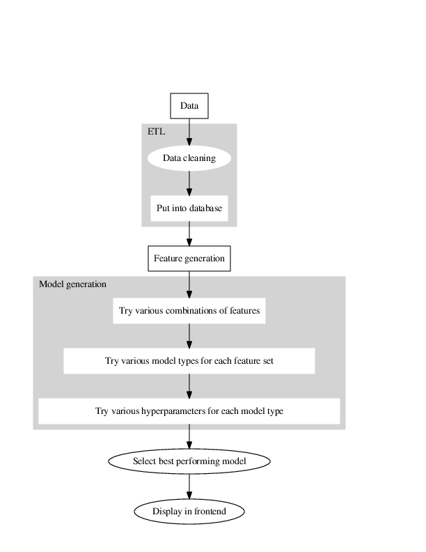

.. police-eis documentation master file, created by
   sphinx-quickstart on Wed Mar 30 12:28:33 2016.
   You can adapt this file completely to your liking, but it should at least
   contain the root `toctree` directive.

Quickstart
==========

This page describes how to get up and running using the police early intervention system from the installation of the software, setup of the datasets (once cleaning and importing the data into a centralized database has been completed), and model generation and selection. 

Installation
------------

Git clone the repository and install with `setup.py`: 

   ``python setup.py install``

Setup
-----

To set up a new police department with the early intervention system, you will need to write some configuration files that define the data sources available, how the code should connect to the database, and what features you want to create.

Database Connection and Data Definition
---------------------------------------

Initial setup is performed via two configuration files, one that contains database credentials, and one that contains configuration unique to the given police department:

* Database credentials are stored in a YAML file ``default_profile`` in the root directory. Use ``example_default_profile`` as a template::

    PGPORT: 65535
    PGHOST: "example.com"
    PGDATABASE: "example"
    PGUSER: "janedoe"
    PGPASSWORD: "supersecretpassword"
    DBCONFIG: "example_police_dept.yaml"

* ``DBCONFIG`` refers to a configuration file containing details of the individual police department, such as unit/district names and what data sources exist for feature generation ``example_police_dept.yaml``.

Running Models
--------------

To run models on this new dataset, edit ``default.yaml``.

Details of experiments, e.g. ranges of hyperparameters as well as features to be included, are stored in a YAML file - example in ``default.yaml``. Configure your experiments as you wish and then::

    In [1]: from eis import experiment

    In [2]: experiment.main()
    2015-11-05 14:53:11,853 - Police EIS: Loaded experiment file
    ...things happen...
    2015-11-05 15:22:52,702 - Police EIS: Training model: RandomForest with {'depth': 20, 'n_estimators': 50, 'criterion': 'entropy'}
    2015-11-05 15:22:53,037 - Police EIS: Saving pickled results...
    2015-11-05 15:22:53,038 - Police EIS: Training model: RandomForest with {'depth': 20, 'n_estimators': 100, 'criterion': 'entropy'}
    2015-11-05 15:22:53,616 - Police EIS: Saving pickled results...
    2015-11-05 15:22:53,617 - Police EIS: Done!

    In [3]:

The following flowchart describes the process of model generation in relation to the ETL and feature generation work: 

At the moment, some of the feature generation work must be done by hand in adapting the SQL queries to the schema used for a given police department's dataset. In addition, new features can be added as described in the following section. 

.. note:: This pipeline covers the steps from when the data is dumped into a centralized database for analysis. 

Adding Features
---------------

To add a new feature or make other code changes, you should follow the instructions in ``contributing.md``. 

.. toctree::
   :maxdepth: 2
   intro
   quickstart

